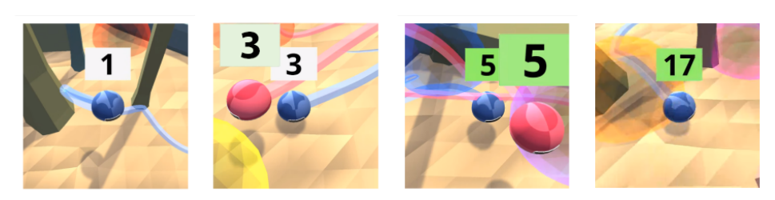
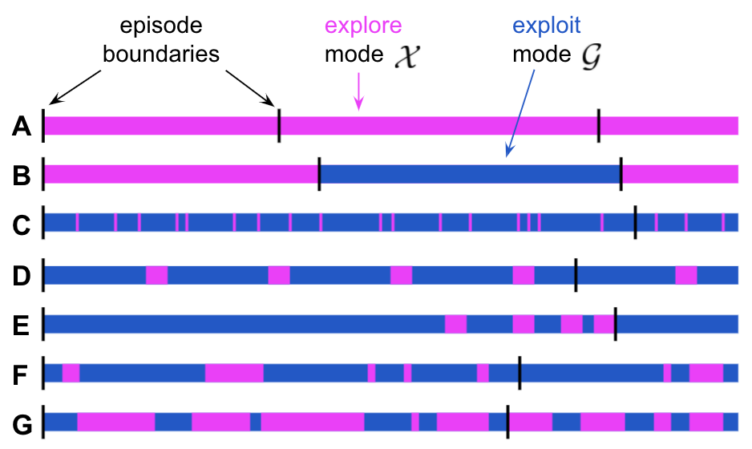
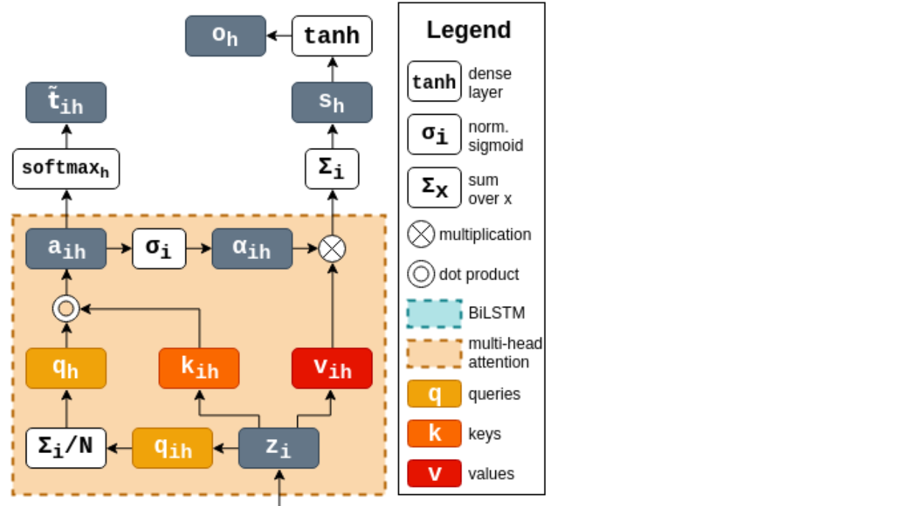
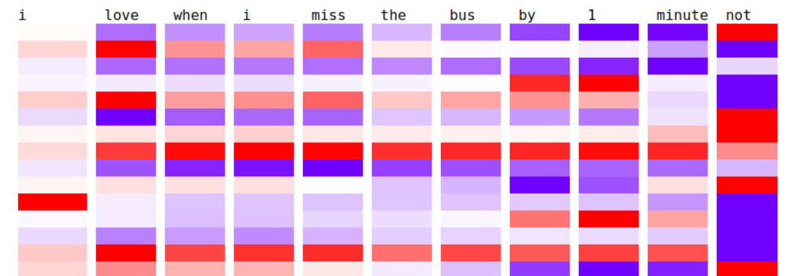

## About

**Career**: I'm a Research Engineer at DeepMind in Paris, working on deep reinforcement learning.

**Education**: I did my BSc in Computer Science at the University of Manchester, UK. Then I completed an MPhil in Advanced Computer Science at the University of Cambridge (Fitzwilliam College).

**Research interests**: representation learning, multi-agent social learning, AI for social good, language evolution.

## Featured Projects

### Social Learning (multi-agent RL) [[paper]](https://arxiv.org/pdf/2203.00715.pdf) [[blog post]](https://www.deepmind.com/publications/learning-robust-real-time-cultural-transmission-without-human-data) [[video website]](https://sites.google.com/corp/view/dm-cgi)

Abstract: _Cultural transmission is the domain-general social skill that allows agents to acquire and use information from each other in real-time with high fidelity and recall. In humans, it is the inheritance process that powers cumulative cultural evolution, expanding our skills, tools and knowledge across generations. We provide a method for generating zero-shot, high recall cultural transmission in artificially intelligent agents. Our agents succeed at real-time cultural transmission from humans in novel contexts without using any pre-collected human data. We identify a surprisingly simple set of ingredients sufficient for generating cultural transmission and develop an evaluation methodology for rigorously assessing it. This paves the way for cultural evolution as an algorithm for developing artificial general intelligence._

### The _when_ of exploration (RL) [[paper]](https://arxiv.org/pdf/2108.11811.pdf)

Abstract: _Exploration remains a central challenge for reinforcement learning (RL). Virtually all existing methods share the feature of a monolithic behaviour policy that changes only gradually (at best). In contrast, the exploratory behaviours of animals and humans exhibit a rich diversity, namely including forms of switching between modes. We present an initial study of mode-switching, non-monolithic exploration for RL. We investigate different modes to switch between, at what timescales it makes sense to switch, and what signals make for good switching triggers. We also propose practical algorithmic components that make the switching mechanism adaptive and robust, which enables flexibility without an accompanying hyper-parameter-tuning burden._

### Multi-head attention for hierarchical text labelling (MPhil dissertation) [[paper]](https://arxiv.org/pdf/2011.00470.pdf) [[code]](https://github.com/MirunaPislar/multi-head-attention-labeller)

Abstract: _In natural languages, words are used in association to construct sentences. It is not words in isolation, but the appropriate combination of hierarchical structures that conveys the meaning of the whole sentence. Neural networks can capture expressive language features; however, insights into the link between words and sentences are difficult to acquire automatically. In this work, we design a deep neural network architecture that explicitly wires lower and higher linguistic components; we then evaluate its ability to perform the same task at different hierarchical levels._

### Sarcasm detection (BSc dissertation) [[code]](https://github.com/MirunaPislar/Sarcasm-Detection) [[youtube video]](https://www.youtube.com/watch?v=ofrn3T76dHg)

Abstract: _At a first, superficial glance, sarcasm might not seem representative of our individuality so as to require much attention from the research community, but a closer look would convince anyone that its sentiment, social and behavioural implications provide essential information about the way humans have historically built their 'feelings' and personality in response to the surrounding environment and their daily interactions. We propose an attention-based LSTM model to detect sarcasm in tweets and analyse the learned features to help our human (and therefore limited) understanding of sarcasm._

## Publications

[Learning Robust Real-Time Cultural Transmission without Human Data](https://arxiv.org/pdf/2203.00715.pdf). Cultural General Intelligence Team, Avishkar Bhoopchand, Bethanie Brownfield, Adrian Collister, Agustin Dal Lago, Ashley Edwards, Richard Everett, Alexandre Frechette, Yanko Gitahy Oliveira, Edward Hughes, Kory W Mathewson, Piermaria Mendolicchio, Julia Pawar, Miruna Pislar, Alex Platonov, Evan Senter, Sukhdeep Singh, Alexander Zacherl, Lei M Zhang. arXiv (2022)

[When should agents explore?](https://arxiv.org/pdf/2108.11811.pdf). Miruna Pîslar, David Szepesvari, Georg Ostrovski, Diana Borsa, Tom Schaul. ICLR (2022).

[Machine translation decoding beyond beam search](https://arxiv.org/pdf/2104.05336.pdf). Rémi Leblond, Jean-Baptiste Alayrac, Laurent Sifre, Miruna Pîslar, Jean-Baptiste Lespiau, Ioannis Antonoglou, Karen Simonyan, Oriol Vinyals. EMNLP (2021).

[Seeing Both the Forest and the Trees: Multi-head Attention for Joint Classification on Different Compositional Levels](https://arxiv.org/pdf/2011.00470.pdf). Miruna Pîslar, Marek Rei. COLING (2020).

## Talks
* _When should agents explore?_ at MILA RL Sofa (April 2022)
* _Transformers: past, present and future_ at the Virtual Grace Hopper Celebration EMEA (2021) [video](https://players.brightcove.net/6180409581001/lat9UJFbI_default/index.html?videoId=6254533527001)
* _Introduction to Natural Language Processing_ at a hackathon organised by TeensInAI Romania (2021)
* Interview on my career path at NEstTV show's "Sinteze Administrative" (2020): [Part 1](https://www.youtube.com/watch?v=_nEzdvENgQo), [Part 2](https://www.youtube.com/watch?v=bOhuA6dhAB4) (**in Romanian**)
