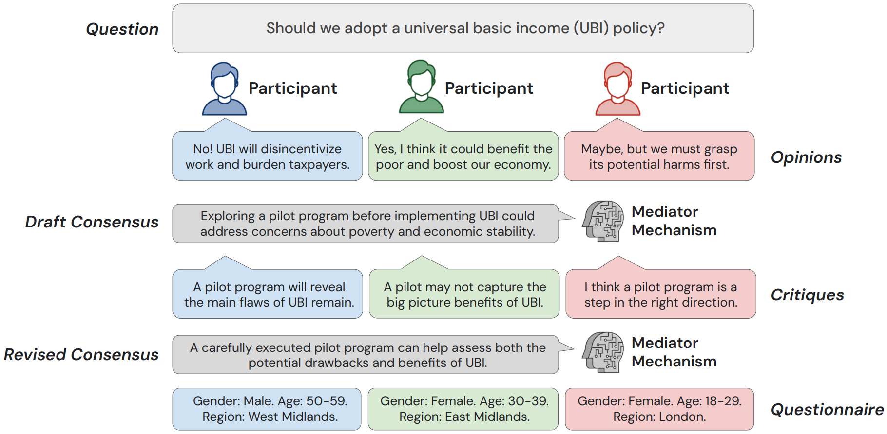
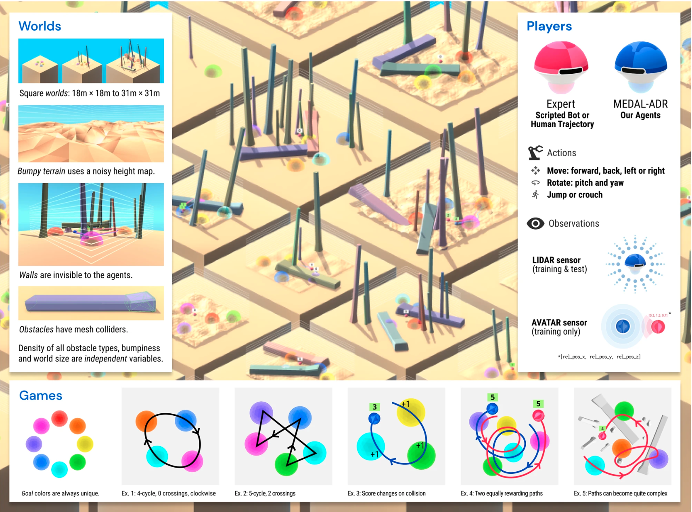

## About

I'm a [Research Engineer](https://www.linkedin.com/in/mirunapislar/) at Google DeepMind in Paris. 

I did my BSc in Computer Science at the University of Manchester, UK. Then I completed an MPhil in Advanced Computer Science at the University of Cambridge.

My research interests span LLMs, reinforcement learning, representation learning, multi-agent social learning, AI for social good, AI Governance, and language evolution.

## Featured Projects

### Language Models as Digital Representatives (LLMs) [[paper]](https://openreview.net/pdf?id=sv7KZcUqu1)

Abstract: _Consider the process of collective decision-making, in which a group of individuals interactively select a preferred outcome from among a universe of alternatives. In this context, "representation" is the activity of making an individual's preferences present in the process via participation by a proxy agent---i.e. their "representative". To this end, learned models of human behavior have the potential to fill this role, with practical implications for multi-agent scenario studies and mechanism design. In this work, we investigate the possibility of training language agents to behave in the capacity of representatives of human agents, appropriately expressing the preferences of those individuals whom they stand for. First, we formalize the setting of collective decision-making---as the episodic process of interaction between a group of agents and a decision mechanism. On this basis, we then formalize the problem of digital representation---as the simulation of an agent's behavior to yield equivalent outcomes from the mechanism. Finally, we conduct an empirical case study in the setting of consensus-finding among diverse humans, and demonstrate the feasibility of fine-tuning large language models to act as digital representatives._

### Social Learning (multi-agent RL) [[Nature Comms]](https://www.nature.com/articles/s41467-023-42875-2) [[arxiv]](https://arxiv.org/pdf/2203.00715.pdf) [[blog post]](https://deepmind.google/discover/blog/learning-robust-real-time-cultural-transmission-without-human-data) [[video website]](https://sites.google.com/corp/view/dm-cgi)

Abstract: _Cultural transmission is the domain-general social skill that allows agents to acquire and use information from each other in real-time with high fidelity and recall. It can be thought of as the process that perpetuates fit variants in cultural evolution. In humans, cultural evolution has led to the accumulation and refinement of skills, tools and knowledge across generations. We provide a method for generating cultural transmission in artificially intelligent agents, in the form of few-shot imitation. Our agents succeed at real-time imitation of a human in novel contexts without using any pre-collected human data. We identify a surprisingly simple set of ingredients sufficient for generating cultural transmission and develop an evaluation methodology for rigorously assessing it. This paves the way for cultural evolution to play an algorithmic role in the development of artificial general intelligence._

### The _when_ of exploration (RL) [[paper]](https://arxiv.org/pdf/2108.11811.pdf) [[ICLR spotlight]](https://iclr.cc/virtual/2022/spotlight/7010) [[poster]](https://raw.githubusercontent.com/MirunaPislar/MirunaPislar.github.io/main/assets/img/iclr-poster.png)

Abstract: _Exploration remains a central challenge for reinforcement learning (RL). Virtually all existing methods share the feature of a monolithic behaviour policy that changes only gradually (at best). In contrast, the exploratory behaviours of animals and humans exhibit a rich diversity, namely including forms of switching between modes. We present an initial study of mode-switching, non-monolithic exploration for RL. We investigate different modes to switch between, at what timescales it makes sense to switch, and what signals make for good switching triggers. We also propose practical algorithmic components that make the switching mechanism adaptive and robust, which enables flexibility without an accompanying hyper-parameter-tuning burden._

### Multi-head attention for hierarchical text labelling (MPhil dissertation) [[paper]](https://arxiv.org/pdf/2011.00470.pdf) [[code]](https://github.com/MirunaPislar/multi-head-attention-labeller)

Abstract: _In natural languages, words are used in association to construct sentences. It is not words in isolation, but the appropriate combination of hierarchical structures that conveys the meaning of the whole sentence. Neural networks can capture expressive language features; however, insights into the link between words and sentences are difficult to acquire automatically. In this work, we design a deep neural network architecture that explicitly wires lower and higher linguistic components; we then evaluate its ability to perform the same task at different hierarchical levels._

### Sarcasm detection (BSc dissertation) [[code]](https://github.com/MirunaPislar/Sarcasm-Detection) [[youtube video]](https://www.youtube.com/watch?v=ofrn3T76dHg)

Abstract: _At a first, superficial glance, sarcasm might not seem representative of our individuality so as to require much attention from the research community, but a closer look would convince anyone that its sentiment, social and behavioural implications provide essential information about the way humans have historically built their 'feelings' and personality in response to the surrounding environment and their daily interactions. We propose an attention-based LSTM model to detect sarcasm in tweets and analyse the learned features to help our human (and therefore limited) understanding of sarcasm._

## Publications

[Language Agents as Digital Representatives in Collective Decision-Making](https://openreview.net/pdf?id=sv7KZcUqu1). Daniel Jarrett*, Miruna Pîslar*, Michael Tessler, Michiel Bakker, Raphael Koster, Jan Balaguer, Romuald Elie, Christopher Summerfield, Andrea Tacchetti. [FMDM Workshop](https://sites.google.com/corp/view/fmdm-neurips23/) at **NeurIPS** (2023).

[Learning few-shot imitation as cultural transmission](https://www.nature.com/articles/s41467-023-42875-2). Avishkar Bhoopchand*, Bethanie Brownfield*, Adrian Collister*, Agustin Dal Lago*, Ashley Edwards*, Richard Everett*, Alexandre Fréchette*, Yanko Gitahy Oliveira*, Edward Hughes*, Kory W. Mathewson*, Piermaria Mendolicchio*, Julia Pawar*, Miruna Pȋslar*, Alex Platonov*, Evan Senter*, Sukhdeep Singh*, Alexander Zacherl*, Lei M. Zhang*. **Nature Communications** (2023).

[BYOL-Explore: Exploration by Bootstrapped Prediction](https://arxiv.org/abs/2206.08332). Zhaohan Daniel Guo*, Shantanu Thakoor*, Miruna Pîslar*, Bernardo Avila Pires*, Florent Altché*, Corentin Tallec*, Alaa Saade, Daniele Calandriello, Jean-Bastien Grill, Yunhao Tang, Michal Valko, Rémi Munos, Mohammad Gheshlaghi Azar, Bilal Piot. **NeurIPS** (2022).

[Learning Robust Real-Time Cultural Transmission without Human Data](https://arxiv.org/pdf/2203.00715.pdf). Cultural General Intelligence Team, Avishkar Bhoopchand, Bethanie Brownfield, Adrian Collister, Agustin Dal Lago, Ashley Edwards, Richard Everett, Alexandre Frechette, Yanko Gitahy Oliveira, Edward Hughes, Kory W Mathewson, Piermaria Mendolicchio, Julia Pawar, Miruna Pîslar, Alex Platonov, Evan Senter, Sukhdeep Singh, Alexander Zacherl, Lei M Zhang. arXiv (2022).

[When should agents explore?](https://arxiv.org/pdf/2108.11811.pdf). Miruna Pîslar, David Szepesvari, Georg Ostrovski, Diana Borsa, Tom Schaul. **ICLR** (2022).

[Machine translation decoding beyond beam search](https://arxiv.org/pdf/2104.05336.pdf). Rémi Leblond, Jean-Baptiste Alayrac, Laurent Sifre, Miruna Pîslar, Jean-Baptiste Lespiau, Ioannis Antonoglou, Karen Simonyan, Oriol Vinyals. **EMNLP** (2021).

[Seeing Both the Forest and the Trees: Multi-head Attention for Joint Classification on Different Compositional Levels](https://arxiv.org/pdf/2011.00470.pdf). Miruna Pîslar, Marek Rei. **COLING** (2020).

## Talks & Events
* **BYOL-Explore** at [NeurIPS Paris event](https://scai.sorbonne-universite.fr/public/events/view/7754b3ff1feea83b10d5/6) (November 2022): [tweet](https://twitter.com/DeepMind/status/1538887456489185283?s=20&t=rjUSkW9Ir9V1A6b-3EC9Iw), [poster](https://nips.cc/media/PosterPDFs/NeurIPS%202022/53367.png?t=1669311560.8058224)
* **Learning Robust Real-Time Cultural Transmission without Human Data** at the [Cognitive Machine Learning (CoML)](https://cognitive-ml.fr/) group at ENS (November 2022): [tweet](https://twitter.com/CoML_ENS/status/1594625442476347394?s=20)
* **Cultural Transmission in AI** at the [Machine learning Workshop](https://ml4evolang.github.io/#speakers) at [EvoLang](https://sites.google.com/corp/view/joint-conf-language-evolution/) in Kanazawa, Japan (September 2022)
* **When should agents explore?** at [ICLR](https://iclr.cc/) (April 2022): [tweet](https://twitter.com/Miruna_Pislar/status/1518702795033092097?s=20&t=rjUSkW9Ir9V1A6b-3EC9Iw), [video](https://iclr.cc/virtual/2022/spotlight/7010)
* **When should agents explore?** at [MILA](https://mila.quebec/en/) RL Sofa (April 2022)
* **Transformers: past, present and future** at the Virtual Grace Hopper Celebration EMEA (2021): [video](https://players.brightcove.net/6180409581001/lat9UJFbI_default/index.html?videoId=6254533527001)
* **Introduction to Natural Language Processing** at a hackathon organised by TeensInAI Romania (2021): [tweet](https://twitter.com/CoML_ENS/status/1594625442476347394?s=20)
* **Interview on my career path** at NEstTV show's "Sinteze Administrative" (2020): [Part 1](https://www.youtube.com/watch?v=_nEzdvENgQo), [Part 2](https://www.youtube.com/watch?v=bOhuA6dhAB4) (in Romanian)
